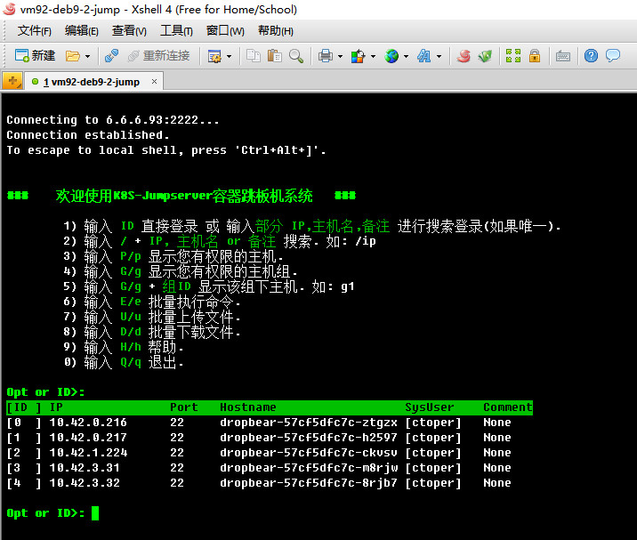

# K8S_Jumpserver跳板机设计简介

------

* 编写日期：2020年4月
* 文档版本：1.0

## 一、使用场景

以屏蔽容器复杂度为初心，出具面向管维及业务排错的工具。目的：还原传统体验 方便开发调试及线上问题排查。使用场景见如下描述及图示

**1.看日志/调应用**

- 快速进入到各个容器，用传统方式进行日志查看。可直接绕过kubectl指令
- 跳到容器内查看应用进程、端口、API接口调试、JVM堆栈打印、jstack等调试工具支持。
- 容器内网络、IO、DNS等基础环境查看，对外交互排查。

**2.物理机/容器纳管**

- 物理机管理：现有支持在WEB面板人工录入物理机器。
- docker-compose单机板容器管理： 正在支持中。(需要在镜像或是启动命令处做支持)
- k8s集群内pod容器管理： 全自动化，K8S容器版跳板机，POD自注册

## 二、快速上手

### 1.帐号信息 2.快速安装

参考README说明 https://github.com/infrastlabs/k8s-jumpserver

### 3.效果图

- ssh控制台

- 容器/主机列表

[操作细节请参考教程](2.K8S_Jumpserver跳板机使用指南.md)

## 三、功能特性

- 1.资产及用户数据仪表盘
- 2.ssh操作日志审计：跳板机特有功能
- 3.webShell控制入口：功能相对简单，可方便临时用手持设备管理，效果上该功能与k8s的dashboard雷同
- 4.支持rz/sz ZModem协议的文件上传下载： 该功能为SSH链接所特有
- 5.精细粒度的用户管理授权：跳板机特有功能 
- 6.纳管的主机及跳板平台的用户在SSH连接时支持密码、密钥两种方式：当前为简化使用，默认预设的密码模式
- 7.web管理后台支持UI界面式的多机器文件上传与下载：建议小文件，仅应急使用
- 8.简化一：当前简化使用，默认初始了`jumpadmin`超级管理员，可再自建普通用户扩展授权   (约定大于配置的理念)
- 9.简化二：预置了`ctapp`, `ctoper`两个系统用户。 后者`sudo su`可免密码到`root`下进行管理维护，前者为应用帐号 可给来开发调试应用看日志

[功能细节请参考功能项说明](2.K8S_Jumpserver跳板机使用指南.md)

**写在最后**

该项目第一个commit始于20.3.30号，借鉴开源回馈开源 公布于`github` `gitee`，欢迎转发、点赞、一键3连!
